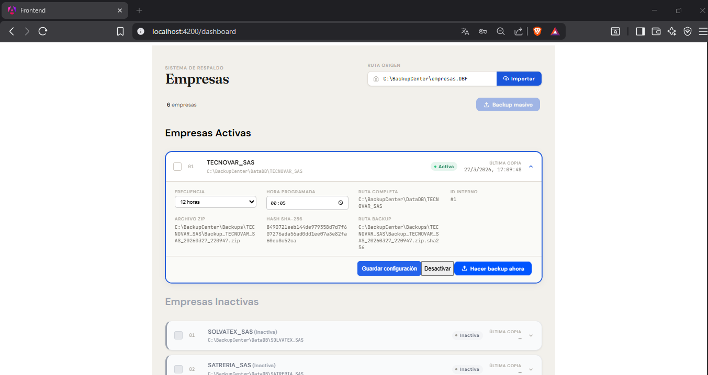
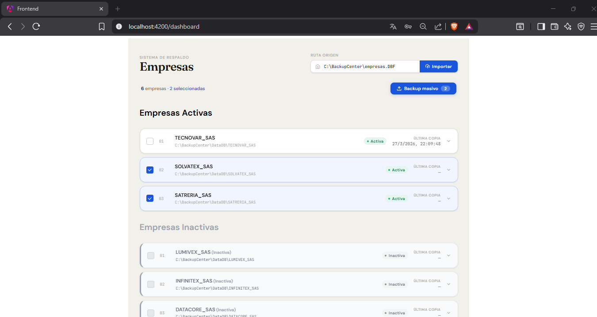
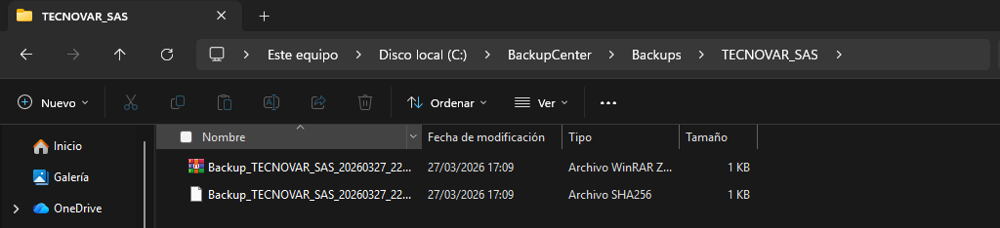

# BackupCenter

**BackupCenter** es un sistema integral para la gestión automatizada y manual de respaldos empresariales, diseñado para entornos donde la integridad, trazabilidad y control de la información son críticos.

Combina una **API robusta en .NET 8** con un frontend moderno en Angular, permitiendo administrar múltiples empresas, programar respaldos y auditar cada operación.

- **Backend (API REST)** desarrollado en .NET 8  
- **Frontend (SPA)** desarrollado en Angular  
---

## Problema que resuelve

En muchas empresas:

* Los respaldos se realizan manualmente (alto riesgo)
* No existe trazabilidad de qué se respaldó
* No hay validación de integridad
* No existe control de acceso ni auditoría

BackupCenter soluciona esto mediante:

* Automatización de respaldos
* Generación de hash SHA-256
* Registro histórico y logs
* Control de usuarios por roles

---

## Arquitectura General

```
[ Angular Frontend ]
        │
        ▼
[ .NET 8 Web API ]
        │
        ▼
[ SQLite Database ]
        │
        ▼
[ File System (.zip + hash) ]
```

## Flujo real del sistema

```
Usuario → Login (JWT)
        → Dashboard
        → Ejecuta backup
        → API procesa:
            - Copia archivos
            - Comprime (.zip)
            - Genera hash SHA-256
            - Guarda en DB
            - Registra logs
```

---

## Componentes del Proyecto

### Backend – BackupCenter API

Microservicio desarrollado en **.NET 8** con arquitectura en capas:

Responsabilidades:

* Autenticación con JWT
* Gestión de usuarios (ADMIN / GERENTE)
* Configuración de empresas
* Ejecución de backups
* Scheduler automático (BackgroundService)
* Auditoría y logs
* Importación desde DBF

Ubicación:
 
```
/backend
```

### Frontend – BackupCenter SPA

Aplicación SPA desarrollada en Angular 18:

Funcionalidades:

* Login de usuarios
* Dashboard interactivo
* Ejecución de backups individuales y masivos
* Visualización de resultados (zip + hash)
* Configuración dinámica de empresas

 Ubicación:

```
/frontend
```

## Seguridad
* Autenticación basada en JWT
* Contraseñas hasheadas con BCrypt
* Interceptor HTTP en frontend
* Separación de roles (ADMIN / GERENTE)

Mejoras futuras:

* Manejo de expiración de tokens
* Uso de cookies HttpOnly
* Encriptación de backups

---

## Características clave

* Backups automáticos y manuales
* Scheduler configurable
* Compresión en .zip
* Generación de hash SHA-256
* Registro en base de datos
* Auditoría completa (logs)
* Importación desde archivos DBF
* Control de concurrencia por empresa

## Persistencia

* Base de datos: SQLite
* ORM: Entity Framework Core

Tablas principales:

* Usuarios
* Empresas
* Backups
* Logs

--- 

## Estructura del repositorio

```
BackupCenter/
│
├── backend/
│   ├── BackupCenter.Api
│   ├── BackupCenter.Application
│   ├── BackupCenter.Domain
│   ├── BackupCenter.Data
│   └── BackupCenter.Infrastructure
│
├── frontend/
│
└── README.md
```
---


## Ejecución del proyecto

1. Clonar repositorio

```
git clone https://github.com/FrVillaI/BackupCenter.git
cd BackupCenter
```

2. Backend

```
cd backend
dotnet restore
dotnet ef database update
dotnet run --project BackupCenter.API
```

* Endpoints:

API disponible en:

```
http://localhost:5000
```

Swagger:

```
http://localhost:5000/swagger
```

3. Frontend

```
cd frontend
npm install
ng serve
```

* Endpoints:

Aplicación disponible en:

```
http://localhost:4200
```

## Configuración importante

**Backend**

**Base de datos:**

```
BackupCenter.db
```

**Ruta DBF:**

```
C:\BackupCenter\EMPRESAS.dbf
```

**Carpeta de backups:**

```
C:\BackupCenter\Backups
```
---

## Consideraciones técnicas

* Las rutas deben existir físicamente
* Se requiere permisos de lectura/escritura
* Tamaño máximo por backup: 50 GB
---

## Roadmap
* Encriptación de base de datos SQLite
* Encriptación de archivos .zip
* Soporte para almacenamiento en la nube
* Notificaciones automáticas de fallos
* Dashboard avanzado (gráficas, métricas)
* Expiración y refresh de JWT
---

## Tecnologías utilizadas

### Backend

- .NET 8  
- Entity Framework Core  
- SQLite  
- BCrypt  

### Frontend

- Angular 18  
- TypeScript  
- Angular CLI  

## Requisitos previos

- Node.js (v18 o superior)  
- Angular CLI  
- .NET SDK 8  
- Git  
---

## Autor

Isaac Villacis

## Licencia

MIT License

---

## Capturas de Pantalla

<p align="center"> 
     
     
     
</p>

